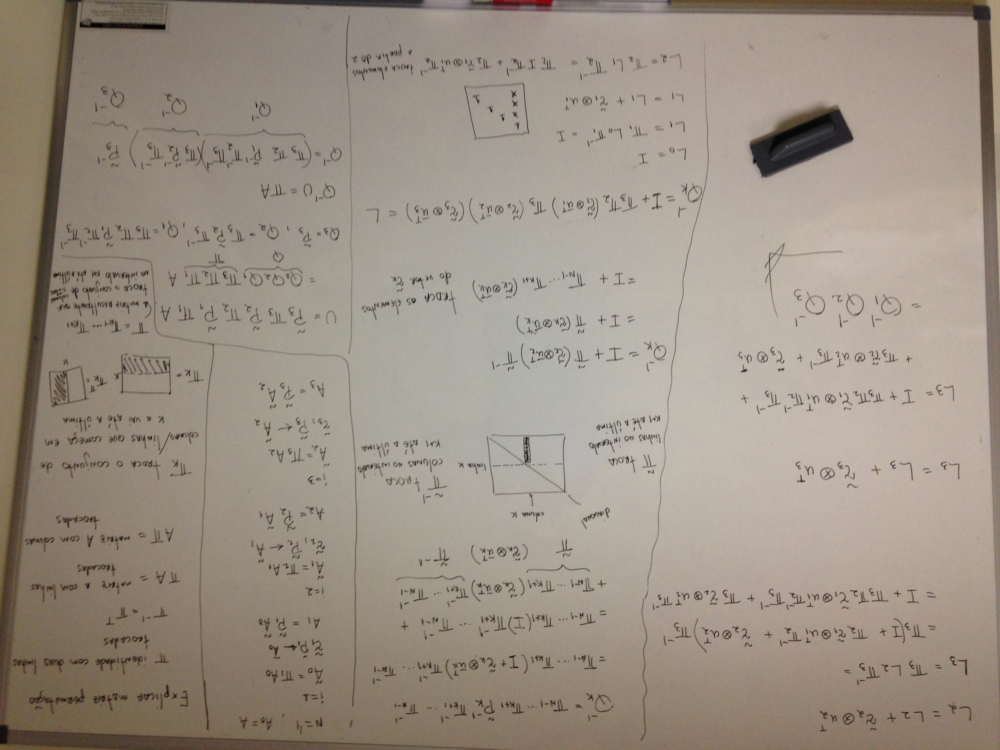

# Brief description of the topics to be studied along the course MCOM

> All the content of this folder can be accessed at [nbviewer](https://nbviewer.jupyter.org/github/birocoles/Disciplina-metodos-computacionais/tree/main/Content/)

#### First steps in Python

The idea here is giving the required background to follow the course.

Access the directory [`first_steps_Python`](https://github.com/birocoles/Disciplina-metodos-computacionais/tree/main/Content/first_steps_Python) and take a look at the instructions.

#### Exercises

A list of all exercises given along the course can be found in [`exercises.md`](https://github.com/birocoles/Disciplina-metodos-computacionais/tree/main/Content/exercises.md).

#### Basic vector operations

- [x] scalar-vector product ([`scalar_vector.ipynb`](https://nbviewer.jupyter.org/github/birocoles/Disciplina-metodos-computacionais/blob/main/Content/scalar_vector.ipynb))

  - [x] timing the scalar vector product ([`timing_scalar_vector_product`](https://nbviewer.jupyter.org/github/birocoles/Disciplina-metodos-computacionais/blob/main/Content/timing_scalar_vector_product.ipynb))

- [x] dot product ([`dot.ipynb`](https://nbviewer.jupyter.org/github/birocoles/Disciplina-metodos-computacionais/blob/main/Content/dot.ipynb))

- [x] Hadamard product ([`hadamard.ipynb`](https://nbviewer.jupyter.org/github/birocoles/Disciplina-metodos-computacionais/blob/main/Content/hadamard.ipynb))

- [x] outer product ([`outer.ipynb`](https://nbviewer.jupyter.org/github/birocoles/Disciplina-metodos-computacionais/blob/main/Content/outer.ipynb))

- [x] cross product ([`cross.ipynb`](https://nbviewer.jupyter.org/github/birocoles/Disciplina-metodos-computacionais/blob/main/Content/cross.ipynb))

- [ ] Vector norms ([`vector-norms.ipynb`](https://nbviewer.jupyter.org/github/birocoles/Disciplina-metodos-computacionais/blob/main/Content/vector-norms.ipynb))

#### Basic matrix operations

- [x] matrix-vector product ([`matrix-vector.ipynb`](https://nbviewer.jupyter.org/github/birocoles/Disciplina-metodos-computacionais/blob/main/Content/matrix-vector.ipynb))

- [x] matrix-matrix product ([`matrix-matrix.ipynb`](https://nbviewer.jupyter.org/github/birocoles/Disciplina-metodos-computacionais/blob/main/Content/matrix-matrix.ipynb))

- [ ] Matrix norms ([`matrix-norms.ipynb`](https://nbviewer.jupyter.org/github/birocoles/Disciplina-metodos-computacionais/blob/main/Content/matrix-norms.ipynb))

#### How to determine the computational cost of a given operation?

- [x] Floating-point operations (flops) ([`flops.ipynb`](https://nbviewer.jupyter.org/github/birocoles/Disciplina-metodos-computacionais/blob/main/Content/flops.ipynb))

#### Structured matrices

- [x] Permutation matrices ([`permutation_matrices.ipynb`](https://nbviewer.jupyter.org/github/birocoles/Disciplina-metodos-computacionais/blob/main/Content/permutation_matrices.ipynb))

- [x] Diagonal matrices - part 1 ([`diagonal_matrices_part1.ipynb`](https://nbviewer.jupyter.org/github/birocoles/Disciplina-metodos-computacionais/blob/main/Content/diagonal_matrices_part1.ipynb))

- [ ] Diagonal matrices - part 2 ([`diagonal_matrices_part2.ipynb`](https://nbviewer.jupyter.org/github/birocoles/Disciplina-metodos-computacionais/blob/main/Content/diagonal_matrices_part2.ipynb))

- [x] Triangular matrices - part 1 ([`triangular_matrices_part1.ipynb`](https://nbviewer.jupyter.org/github/birocoles/Disciplina-metodos-computacionais/blob/main/Content/triangular_matrices_part1.ipynb))

- [ ] Triangular matrices - part 2 ([`triangular_matrices_part2.ipynb`](https://nbviewer.jupyter.org/github/birocoles/Disciplina-metodos-computacionais/blob/main/Content/triangular_matrices_part2.ipynb))

- [ ] Symmetric matrices ([`symmetric_matrices.ipynb`](https://nbviewer.jupyter.org/github/birocoles/Disciplina-metodos-computacionais/blob/main/Content/symmetric_matrices.ipynb))

- [ ] Band matrices ([`band_matrices.ipynb`](https://nbviewer.jupyter.org/github/birocoles/Disciplina-metodos-computacionais/blob/main/Content/band_matrices.ipynb))

- [x] Block matrices ([`block_matrices.ipynb`](https://nbviewer.jupyter.org/github/birocoles/Disciplina-metodos-computacionais/blob/main/Content/block_matrices.ipynb))

#### Discrete Fourier Transform

- [x] Fourier Transform 1D - intro ([`fourier_1D_intro.ipynb`](https://nbviewer.jupyter.org/github/birocoles/Disciplina-metodos-computacionais/blob/main/Content/fourier_1D_intro.ipynb))

- [x] Fourier Transform 1D - part 1 ([`fourier_1D_1.ipynb`](https://nbviewer.jupyter.org/github/birocoles/Disciplina-metodos-computacionais/blob/main/Content/fourier_1D_1.ipynb))

- [x] Fourier Transform 1D - part 2 ([`fourier_1D_2.ipynb`](https://nbviewer.jupyter.org/github/birocoles/Disciplina-metodos-computacionais/blob/main/Content/fourier_1D_2.ipynb))

  - [x] Fourier Series - functions with period 2pi ([`fourier_series_2pi.ipynb`](https://nbviewer.jupyter.org/github/birocoles/Disciplina-metodos-computacionais/blob/main/Content/fourier_series_2pi.ipynb))

- [x] Fourier Transform 1D - part 3 ([`fourier_1D_3.ipynb`](https://nbviewer.jupyter.org/github/birocoles/Disciplina-metodos-computacionais/blob/main/Content/fourier_1D_3.ipynb))

  - [x] Fourier Series - functions with arbitrary period ([`fourier_series_T0.ipynb`](https://nbviewer.jupyter.org/github/birocoles/Disciplina-metodos-computacionais/blob/main/Content/fourier_series_T0.ipynb))

- [x] Fourier Transform 1D - part 4 ([`fourier_1D_4.ipynb`](https://nbviewer.jupyter.org/github/birocoles/Disciplina-metodos-computacionais/blob/main/Content/fourier_1D_4.ipynb))

  - [x] Example DFT 1D for N = 6 ([`fourier_1D_4_example.pdf`](https://nbviewer.jupyter.org/github/birocoles/Disciplina-metodos-computacionais/blob/main/Content/fourier_1D_4_example.pdf))

- [x] Fourier Transform 1D - part 5 ([`fourier_1D_5.ipynb`](https://nbviewer.jupyter.org/github/birocoles/Disciplina-metodos-computacionais/blob/main/Content/fourier_1D_5.ipynb))

- [x] Fourier Transform 1D - part 6 ([`fourier_1D_6.ipynb`](https://nbviewer.jupyter.org/github/birocoles/Disciplina-metodos-computacionais/blob/main/Content/fourier_1D_6.ipynb))

- [x] Convolution and Correlation 1D - part 1 ([`convolution_correlation_1D_1.ipynb`](https://nbviewer.jupyter.org/github/birocoles/Disciplina-metodos-computacionais/blob/main/Content/convolution_correlation_1D_1.ipynb))

  - [x] Example 1D Convolution ([`conv_1D.pdf`](https://nbviewer.jupyter.org/github/birocoles/Disciplina-metodos-computacionais/blob/main/Content/conv_1D2D/conv_1D.pdf))

  - [x] Toeplitz and circulant matrices ([`Toeplitz_circulant_matrices.ipynb`](https://nbviewer.jupyter.org/github/birocoles/Disciplina-metodos-computacionais/blob/main/Content/Toeplitz_circulant_matrices.ipynb))

- [x] Convolution and Correlation 1D - part 2 ([`convolution_correlation_1D_2.ipynb`](https://nbviewer.jupyter.org/github/birocoles/Disciplina-metodos-computacionais/blob/main/Content/convolution_correlation_1D_2.ipynb))

- [x] Fourier Transform 2D - intro ([`fourier_2D_intro.ipynb`](https://nbviewer.jupyter.org/github/birocoles/Disciplina-metodos-computacionais/blob/main/Content/fourier_2D_intro.ipynb))

- [x] Fourier Transform 2D ([`fourier_2D.ipynb`](https://nbviewer.jupyter.org/github/birocoles/Disciplina-metodos-computacionais/blob/main/Content/fourier_2D.ipynb))

  - [x] Example DFT 2D for N = 4, M = 4 ([`fourier_2D_example.pdf`](https://nbviewer.jupyter.org/github/birocoles/Disciplina-metodos-computacionais/blob/main/Content/fourier_2D_example.pdf))

- [x] Convolution 2D ([`convolution_2D.ipynb`](https://nbviewer.jupyter.org/github/birocoles/Disciplina-metodos-computacionais/blob/main/Content/convolution_2D.ipynb))

  - [x] Example 2D Convolution ([`conv_2D.pdf`](https://nbviewer.jupyter.org/github/birocoles/Disciplina-metodos-computacionais/blob/main/Content/conv_1D2D/conv_2D.pdf))

  - [x] Block Toeplitz and circulant matrices ([`Block_Toeplitz_circulant_matrices.ipynb`](https://nbviewer.jupyter.org/github/birocoles/Disciplina-metodos-computacionais/blob/main/Content/Block_Toeplitz_circulant_matrices.ipynb))

  - [x] Kronecker product ([`kronecker-product.ipynb`](https://nbviewer.jupyter.org/github/birocoles/Disciplina-metodos-computacionais/blob/main/Content/kronecker-product.ipynb))

#### Numerical solution of linear systems

- [x] Introduction to linear systems ([`intro_linear_syst.ipynb`](https://nbviewer.jupyter.org/github/birocoles/Disciplina-metodos-computacionais/blob/main/Content/intro_linear_syst.ipynb))

- [x] Triangular systems ([`triangular_systems.ipynb`](https://nbviewer.jupyter.org/github/birocoles/Disciplina-metodos-computacionais/blob/main/Content/triangular_systems.ipynb))

- [x] Gaussian elimination - Introduction ([`gauss-elim-intro.ipynb`](https://nbviewer.jupyter.org/github/birocoles/Disciplina-metodos-computacionais/blob/main/Content/gauss-elim-intro.ipynb))

- [x] Gaussian elimination - Outer product formulation ([`gauss-elim-outer.ipynb`](https://nbviewer.jupyter.org/github/birocoles/Disciplina-metodos-computacionais/blob/main/Content/gauss-elim-outer.ipynb))

- [x] Gaussian elimination - Pivoting ([`gauss-elim-pivoting.ipynb`](https://nbviewer.jupyter.org/github/birocoles/Disciplina-metodos-computacionais/blob/main/Content/gauss-elim-pivoting.ipynb))

- [x] LU decomposition - Introduction ([`lu_decomp_intro.ipynb`](https://nbviewer.jupyter.org/github/birocoles/Disciplina-metodos-computacionais/blob/main/Content/lu_decomp_intro.ipynb))

- [x] LU decomposition - Pivoting ([`lu_decomp_pivoting.ipynb`](https://nbviewer.jupyter.org/github/birocoles/Disciplina-metodos-computacionais/blob/main/Content/lu_decomp_pivoting.ipynb))

- [x] LDLT decomposition - Symmetric matrices ([`ldlt_decomp.ipynb`](https://nbviewer.jupyter.org/github/birocoles/Disciplina-metodos-computacionais/blob/main/Content/ldlt_decomp.ipynb))

- [x] Cholesky decomposition - Symmetric and positive definite matrices ([`chol_decomp.ipynb`](https://nbviewer.jupyter.org/github/birocoles/Disciplina-metodos-computacionais/blob/main/Content/chol_decomp.ipynb))

- [x] Least Squares ([`least_squares.ipynb`](https://nbviewer.jupyter.org/github/birocoles/Disciplina-metodos-computacionais/blob/main/Content/least_squares.ipynb))

  - [x] Review 1 ([`review_math_1.ipynb`](https://nbviewer.jupyter.org/github/birocoles/Disciplina-metodos-computacionais/blob/main/Content/review_math_1.ipynb))

  - [x] Fitting a straight line
  ([`straight_line.ipynb`](https://nbviewer.jupyter.org/github/birocoles/Disciplina-metodos-computacionais/blob/main/Content/straight_line.ipynb))

- [x] Weighted Least Squares ([`weighted_least_squares.ipynb`](https://nbviewer.jupyter.org/github/birocoles/Disciplina-metodos-computacionais/blob/main/Content/weighted_least_squares.ipynb))

  - [x] Simple gravity network ([`grav_net.ipynb`](https://nbviewer.jupyter.org/github/birocoles/Disciplina-metodos-computacionais/blob/main/Content/grav_net.ipynb))

- [x] L1 regression ([`L1_regression.ipynb`](https://nbviewer.jupyter.org/github/birocoles/Disciplina-metodos-computacionais/blob/main/Content/L1_regression.ipynb))

  - [x] Fitting a parabola with outliers
  ([`parabola.ipynb`](https://nbviewer.jupyter.org/github/birocoles/Disciplina-metodos-computacionais/blob/main/Content/parabola.ipynb))

- [x] Steepest decent with exact Line Search
([`sd_exact_lsearch.ipynb`](https://nbviewer.jupyter.org/github/birocoles/Disciplina-metodos-computacionais/blob/main/Content/sd_exact_lsearch.ipynb))

- [x] Conjugate Gradient Method
([`cg_method.ipynb`](https://nbviewer.jupyter.org/github/birocoles/Disciplina-metodos-computacionais/blob/main/Content/cg_method.ipynb))

#### Numerical solution of nonlinear systems

> This topic is given in class and part of it can be found in the files `Nonlinear_methods.odp` and `Nonlinear_methods.pdf`

- [ ] Simple epicenter problem ([`epicenter.ipynb`](https://nbviewer.jupyter.org/github/birocoles/Disciplina-metodos-computacionais/blob/main/Content/epicenter.ipynb))

  - [ ] Review 2 ([`review_math_2.ipynb`](https://nbviewer.jupyter.org/github/birocoles/Disciplina-metodos-computacionais/blob/main/Content/review_math_2.ipynb))

#### Interpolation and curve fitting

- [ ] Lagrange's method ([`Lagrange.ipynb`](https://nbviewer.jupyter.org/github/birocoles/Disciplina-metodos-computacionais/blob/main/Content/Lagrange.ipynb))

- [ ] Neville's method ([`Neville.ipynb`](https://nbviewer.jupyter.org/github/birocoles/Disciplina-metodos-computacionais/blob/main/Content/Neville.ipynb))

- [ ] Polynomial fitting ([`polynomial.ipynb`](https://nbviewer.jupyter.org/github/birocoles/Disciplina-metodos-computacionais/blob/main/Content/polynomial.ipynb))

- [ ] Spline interpolation with Green's functions ([`greens_interp_theory.ipynb`](https://nbviewer.jupyter.org/github/birocoles/Disciplina-metodos-computacionais/blob/main/Content/greens_interp_theory.ipynb))

  - [ ] 1D case ([`greens_interp_1D.ipynb`](https://nbviewer.jupyter.org/github/birocoles/Disciplina-metodos-computacionais/blob/main/Content/greens_interp_1D.ipynb))

  - [ ] 2D case ([`greens_interp_2D.ipynb`](https://nbviewer.jupyter.org/github/birocoles/Disciplina-metodos-computacionais/blob/main/Content/greens_interp_2D.ipynb))

#### Numerical solution of differential equations

* Finite differences - part 1 (extra) ([`fd_intro1.ipynb`](https://nbviewer.jupyter.org/github/birocoles/Disciplina-metodos-computacionais/blob/main/Content/fd_intro1.ipynb))

    - [ ] Exercise: Solve the exponential decay equation

* Finite differences - part 2 (extra) ([`fd_intro2.ipynb`](https://nbviewer.jupyter.org/github/birocoles/Disciplina-metodos-computacionais/blob/main/Content/fd_intro2.ipynb))

    - [ ] Exercise: Generalize the previous code

* Finite differences (extra)
([12 Steps to Navier-Stokes](https://github.com/barbagroup/CFDPython))

    - [ ] Exercise - Complete this amazing practical module for learning the foundations of Computational Fluid Dynamics (CFD) developed by [Prof. Lorena Barba](http://lorenabarba.com/).
    Create a new Jupyter Notebook for each lesson and follow the instructions.

#### Numerical integration

* Newton-Cotes formulas (extra) ([`newton-cotes.ipynb`](https://nbviewer.jupyter.org/github/birocoles/Disciplina-metodos-computacionais/blob/main/Content/newton-cotes.ipynb))

    - [ ] Exercise: Simulate an abrupt temperature perturbation
