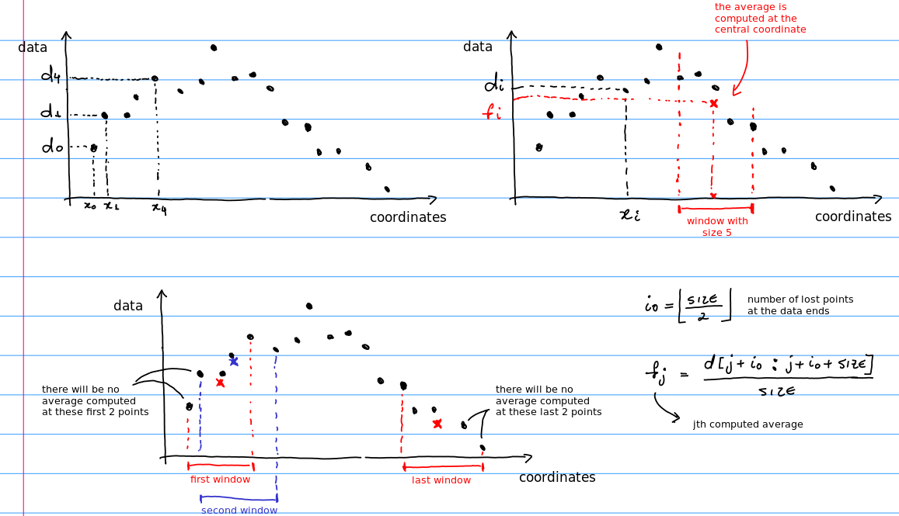

# Simple Moving Average (SMA)

After learning some Python stuff, let us create our first code. Our code is an
implementation of the [SMA filter](https://en.wikipedia.org/wiki/Moving_average#Simple_moving_average).

The main goal is:

* [creating a 1D numpy array](http://docs.scipy.org/doc/numpy/reference/routines.array-creation.html);
* [slicing and indexing](https://numpy.org/doc/stable/reference/arrays.indexing.html) numpy arrays;
* practicing the concept of loops;
* creating functions;
* documenting the code;
* testing the code.

In this class, we use the following notebooks:

* [`sma-1.ipynb`](https://nbviewer.jupyter.org/github/birocoles/Disciplina-metodos-computacionais/blob/master/Content/first_steps_Python/SMA/sma-1.ipynb)
* [`sma-2.ipynb`](https://nbviewer.jupyter.org/github/birocoles/Disciplina-metodos-computacionais/blob/master/Content/first_steps_Python/SMA/sma-2.ipynb)

and the following files:

* [`sma_functions.py`](https://github.com/birocoles/Disciplina-metodos-computacionais/blob/master/Content/first_steps_Python/SMA/sma_functions.py)
* [`test_sma_functions.py`](https://github.com/birocoles/Disciplina-metodos-computacionais/blob/master/Content/first_steps_Python/SMA/test_sma_functions.py)

Compare our implementation with the routine [`numpy.convolve`](https://numpy.org/doc/stable/reference/generated/numpy.convolve.html).
