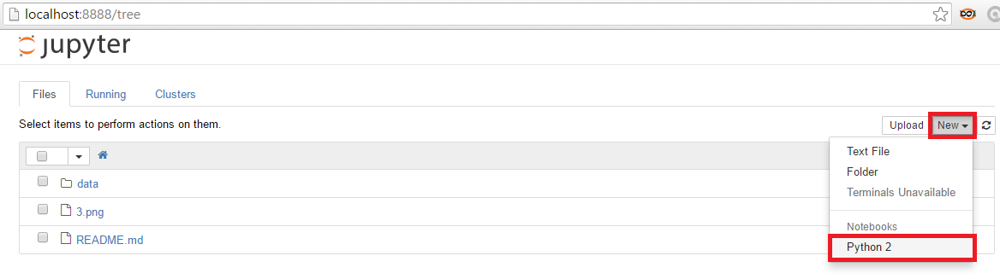
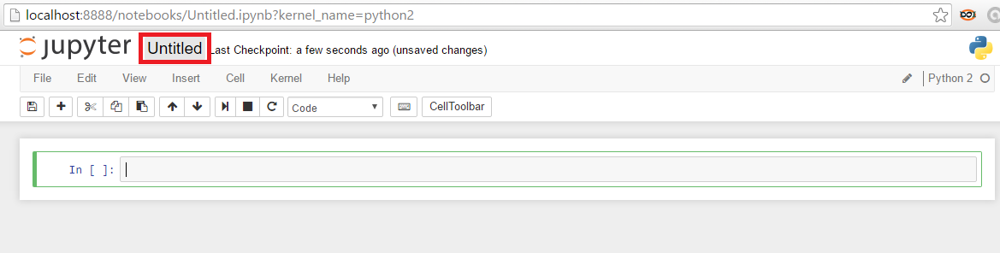

# Guide for creating your first notebook

1. Crie uma pasta para salvar os arquivos gerados nesta disciplina.

2. Abra o cmd do Windows ou um terminal do Linux e execute o comando: `jupyter notebook`

    

3. Crie um notebook chamado `analyzing_patient_data`

    a) [Como criar um notebook](http://jupyter-notebook.readthedocs.io/en/latest/notebook.html#creating-a-new-notebook-document)

    

    b) Modifique o nome do notebook

    

    c) Modifique a primeira célula do notebook de `Code` para `Markdown` e
    escreva o título do notebook

    
    
4. Execute a primeira célula

    
    
    Há duas formas de executar a célula: clicando no botão destacado na figura acima
    ou pressionando o atalho `shift`+`enter`
    
5. Execute o comando `import numpy` na segunda célula

    
    
6. Execute outros comandos nas células abaixo
