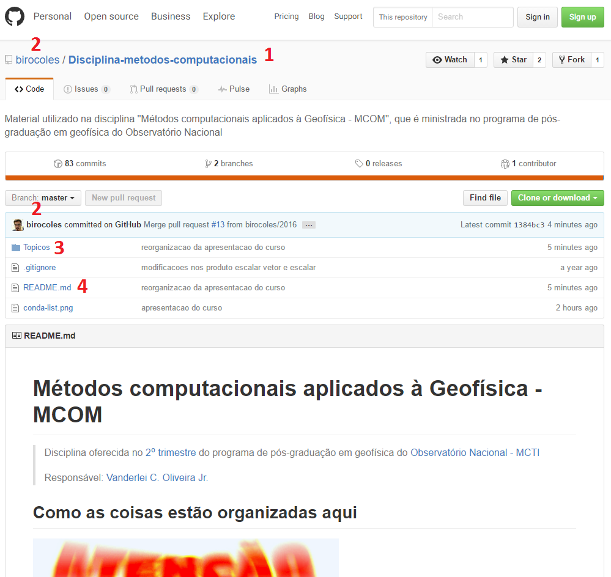
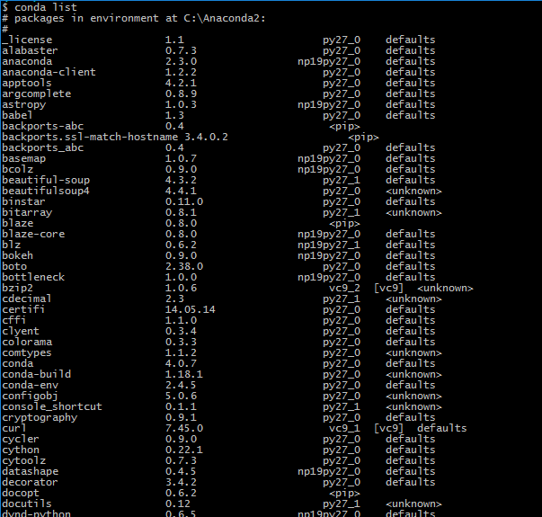

# Métodos computacionais aplicados à Geofísica - MCOM

Disciplina oferecida no [Programa de Pós-Graduação em
Geofísica](http://www.on.br/index.php/pt-br/programas-academicos/geofisica.html) do [Observatório Nacional](http://www.on.br).

**Responsável**: [Vanderlei C. Oliveira Jr.](http://www.pinga-lab.org/people/oliveira-jr.html)

**Aviso Legal:** O material disponibilizado neste repositório está em constante desenvolvimento e o Observatório Nacional não tem nenhuma responsabilidade sobre o seu conteúdo.

## Como as coisas estão organizadas aqui

Esta página é um repositório no GitHub. Mas que raio é isso?
Pois é, muita gente ao redor do mundo tem utilizado o Git e o GitHub para
fazer colaborações em suas pesquisas, divulgar a pesquisa, divulgar
o material desenvolvido em disciplinas, palestras, seminários, etc.
AO LONGO DESTE CURSO, NÃO SERÁ COBRADO O CONHECIMENTO SOBRE Git OU
GitHub. Mas, como conhecimento nunca é demais, abaixo segue uma
lista de links úteis sobre Git e GitHub:

* [Tudo que você queria saber sobre Git e GitHub, mas tinha vergonha de perguntar](http://tableless.com.br/tudo-que-voce-queria-saber-sobre-git-e-github-mas-tinha-vergonha-de-perguntar/)

* [Software Carpentry - Version Control with Git](http://swcarpentry.github.io/git-novice/)

* [Good Resources for Learning Git and GitHub](https://help.github.com/articles/good-resources-for-learning-git-and-github/)

Beleza, é possível que as informações acima tenham sido completamente
inúteis para este curso. Sendo assim, vamos agilizar um pouco as
coisas, afinal, você não quer ficar lendo um monte de baboseiras,
tal como estas duas últimas frases que você acabou de ler :P
Pois bem, a ideia é que você utilize este repositório apenas como
uma página que contém todo o material do curso. Dessa forma,
eu coloquei logo abaixo um *print screen* da parte superior desta página.
O objetivo é apontar o que é útil pra você no meio desse monte de coisa. Eu optei
por fazer assim porque, no início, o GitHub é meio assustador. Eu coloquei
números para identificar os pontos importantes e, logo abaixo da imagem,
estes pontos são descritos.

1. **Disciplina-metodos-computacionais** é o nome deste repositório no GitHub

2. **birocoles** é o meu nome no GitHub

3. Arquivo onde está escrito isso que você está lendo agora. O GitHub se encarrega
de deixar as coisas bonitas. Se quiser saber mais, a notação utilizada para escrever
estas coisas é o [Markdown](https://www.markdownguide.org/).

4. Esta pasta contém os códigos a serem utilizados neste curso.
No item **Visualização online dos Jupyter Notebooks**, apresentado abaixo, há uma
descrição de como acessar o conteúdo desta pasta.

Pronto, só isso. Agora, leia o conteúdo abaixo, com atenção. Há várias informações
úteis sobre a disciplina.

## Por que usar a linguagem Python?

A primeira coisa importante aqui é entender [quando usar 'porque', 'por que',
'porquê' e 'por quê'](https://www.bbc.com/portuguese/brasil-39572054).
Certamente, isso é mais díficl do que o conteúdo deste curso.

Diferentemente de C ou Fortran, a linguagem [Python](https://www.python.org/)
é interpretada. Isso significa que o código não precisa ser previamente
compilado e os comandos são executados imediatamente. De acordo com a
[Software Carpentry](http://software-carpentry.org/index.html), quando
estamos programando, o tempo total necessário para obtermos a solução
desejada é determinado por duas coisas: *o tempo gasto por* **você** *para
desenvolver o código* e *o tempo gasto pelo* **computador** *para rodar o
código*. Estes fatores devem ser levados em consideração no momento da
escolha de uma linguagem de programação. Para fins acadêmicos de pesquisa
e ensino, a linguagem Python oferece algumas vantagens, dentre as quais
eu destaco o fato de ser gratuita e distribuída livremente na internet,
relativamente fácil de aprender e extremamente bem documentada.

Neste curso, usaremos a distribuição **Python Anaconda 3.x** e os códigos serão
feitos com o **Jupyter Notebook**. Para instalar as coisas que usaremos aqui,
vá até a seção **Instalação do Python e de suas dependências** apresentada
abaixo.

## Jupyter Notebook

O [Jupyter Notebook](https://jupyter.org/) é um
arquivo com extensão `.ipynb` e permite combinar código, texto, equações feitas
em LaTeX, figuras e animações. Além disso, é gratuito e extremamente bem
documentado. Esta poderosa ferramenta computacional possibilita reunir (quase)
todas as etapas envolvidas no desenvolvimento de um código com fins acadêmicos,
desde a leitura e processamento dos dados até a visualização dos resultados.

Os Jupyter Notebooks estão armazenados dentro do diretório `Content` e podem
ser visualizados como páginas estáticas no nbviewer. Para tanto, acesse o link
abaixo:

### [Contéudo da pasta `Content` no nbviewer](https://nbviewer.jupyter.org/github/birocoles/Disciplina-metodos-computacionais/tree/master/Content/)

Neste link, é possível visualizar um determinado Jupyter Notebook apenas
clicando sobre ele, sem segredo. Por exemplo, para visualizar o Jupyter
Notebook `dot.ipynb`, dentro da pasta `Content`, acesse o link acima e,
em seguida, clique no arquivo.

Para quem leu alguma coisa sobre GitHub, note que o conteúdo do link acima
reflete o branch master. Ao longo do curso, eu costumo trabalhar em um branch
separado. Geralmente, o nome deste branch é o ano em que a disciplina está sendo
ministrada porque eu sou muito criativo. O conteúdo deste branch é incorporado
ao master ao longo do curso.

Note que, desta forma, os Jupyter Notebooks são vistos como páginas estáticas.
Para executar um determinado Jupyter Notebook, é necessário baixa-lo e instalar
os programas necessários de acordo com a seção
**Instalação do Python e de suas dependências**.

## Instalação do Python e de suas dependências

Para instalar o Python Anaconda, sugiro acessar diretamente o [site do Python Anaconda](https://docs.anaconda.com/anaconda/install/).

**IMPORTANTE**: Usaremos o Python 3.x!

Para checar se a instalação deu certo, abra uma janela do prompt de comando,
caso você esteja no Windows, ou um terminal, se estiver no Linux. Em seguida,
Digite o comando: `conda list`. Este comando mostrará uma lista de *coisas* que
foram instaladas pelo Anaconda. Deve aparecer algo do tipo:

 

 A lista de pacotes continua em ordem alfabética. Note que as informações
 associadas ao pacote `anaconda` são `2019.03` e `py36_0`.

 ## Tópicos abordados durante a disciplina

 O diretório `Content` contem os tópicos abordados durante o curso.

 ## Recommended bibliography

 * Graham, L., D. E. Knuth, and O. Patashnik (1994). Concrete mathematics: a foundation for computer science, 2 ed.: Addison-Wesley Publishing Company. ISBN 0-201-55802-5

  * Kelley, C. T. Iterative methods for optimization, SIAM, 1999, [versão pdf](http://www.siam.org/books/kelley/fr18/)

  * Yilmaz, Öz (2001). Seismic Data Analysis: Processing, Inversion, and Interpretation of Seismic Data, 2 ed.: Society of Exploration Geophysicists. ISBN 1-56080-098-4

  * Press, W. H., Teukolsky, S. A, Vetterling, W. T. e Flannery, B. P. Numerical recipes in C: The art of scientific computing, 3rd edition, Cambridge University Press, 2007, ISBN 978-0-511-33555-6,
  url: http://numerical.recipes/

  * Oppenheim, A. V., and Schafer, R., W. (2010). Discrete-Time Signal Processing, 3 ed.: Pearson. ISBN 0-13-198842-5

 * Kiusalaas, J. Numerical methods in engineering with Python 3, 3rd edition, Cambridge University Press, 2013, ISBN 978-1-107-03385-6

 * Golub, G. H. and Van Loan, C. F. Matrix computations, 4th edition, Johns Hopkins University Press, 2013, ISBN 978-1-4214-0859-0

 * Menke, W. and Menke, J. Environmental Data Analysis with MATLAB, 2nd edition, Academic Press, 2016, ISBN 978-0-12-804488-9

 * Menke, W. Geophysical Data Analysis: Discrete inverse theory, 4th edition, Academic Press, 2018, ISBN 978-0-12-813555-6

 * Aster, R. C., Borchers, B., and Thurber, C. H. Parameter Estimation and Inverse Problems, 3rd edition Elsevier Academic Press, 2019, ISBN: 978-0-12-804651-7

 **P.S.**: This list may be updated along the course.

 ## Useful links

 * [Fatiando a Terra](http://www.fatiando.org/index.html)

 * [Computational Infrastructure for Geodynamics (CIG)](http://geodynamics.org/cig/)

 * [Generic Mapping Tools (GMT)](http://gmt.soest.hawaii.edu/projects/gmt/wiki)

 * [CFD Python: 12 steps to Navier-Stokes :: Lorena A. Barba group](https://github.com/barbagroup/CFDPython)

 * [Software Carpentry](http://software-carpentry.org/index.html)

 * [Pythonic Perambulations](https://jakevdp.github.io/)

 * [A gallery of interesting Jupyter Notebooks](https://github.com/jupyter/jupyter/wiki/A-gallery-of-interesting-Jupyter-Notebooks)

 * [Notebook Gallery - Links to the best IPython and Jupyter Notebooks](http://nb.bianp.net/sort/views/)

 * [matplotlib - 2D and 3D plotting in Python](http://nbviewer.jupyter.org/github/jrjohansson/scientific-python-lectures/blob/master/Lecture-4-Matplotlib.ipynb)

 * [WolframMathWorld](http://mathworld.wolfram.com/)

 * [Various writings - Hans Petter Langtangen](http://hplgit.github.io/)

 * [scikit-learn: Machine Learning in Python](http://scikit-learn.org/stable/index.html)

 * [Codecademy](https://www.codecademy.com/about)

 * [Pandas](http://pandas.pydata.org/)

 * [SciPy](https://scipy.org/about.html)
