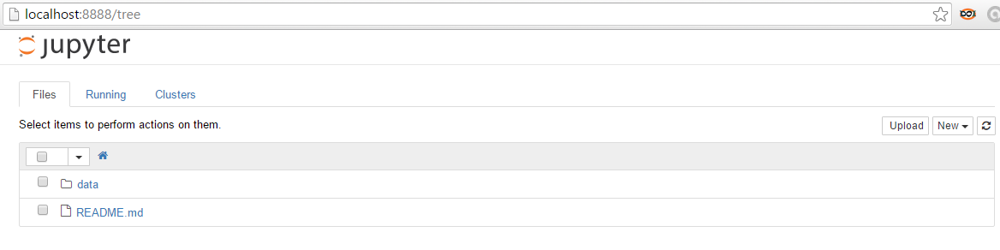
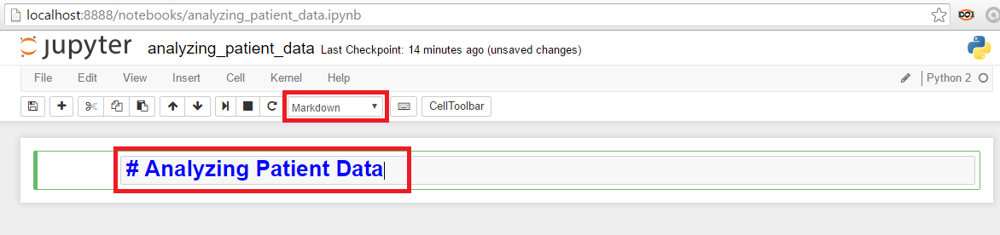

#Guia para execução das lições [Programming with Python](http://swcarpentry.github.io/python-novice-inflammation/)

1. Crie uma pasta para salvar os arquivos das lições.
Todas as etapas abaixo serão realizadas dentro desta pasta.

2. Baixe os dados `python-novice-inflammation-data.zip`

    Os dados estarão compactados em formato `.zip`. Descompacte a pasta `dados`
    e apague o arquivo `.zip`.

3. Abra o cmd do Windows ou um terminal do Linux e execute o comando: `jupyter notebook`

    

4. Crie um notebook chamado `analyzing_patient_data`

    a) [Como criar um notebook](http://jupyter-notebook.readthedocs.io/en/latest/notebook.html#creating-a-new-notebook-document)

    

    b) Modifique o nome do notebook

    

    c) Modifique a primeira célula do notebook de `Code` para `Markdown` e
    escreva o título do notebook

    
    
5. Execute a primeira célula

    
    
    Há duas formas de executar a célula: clicando no botão destacado na figura acima
    ou pressionando o atalho `shift`+`enter`
    
6. Execute o comando `import numpy` na segunda célula

    
    
7. Execute todos os exemplos da lição, cada um em uma célula separada

8. Faça todas as tarefas, cada uma em uma célula separada

